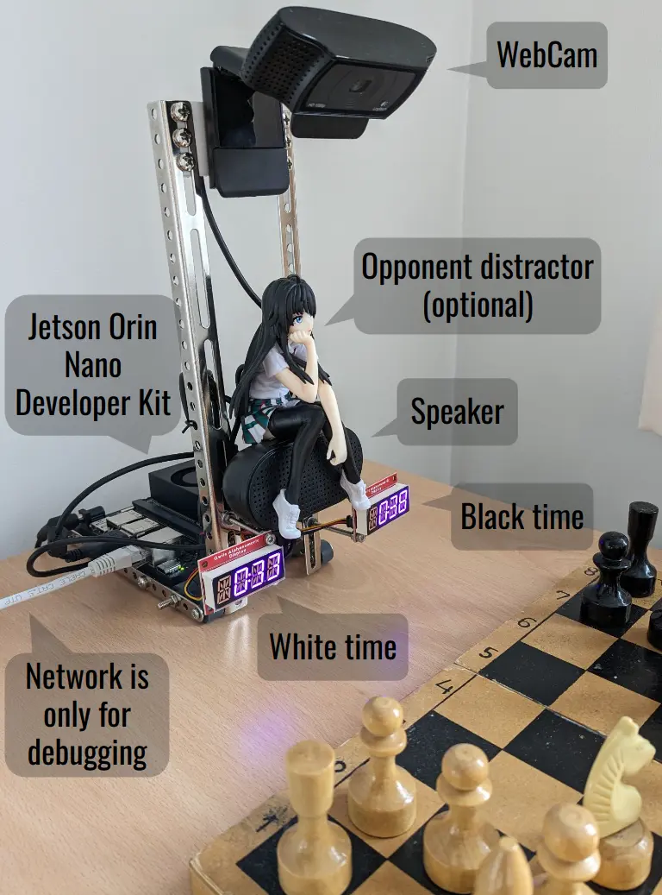

# Hands Free Chess Clock


## Example hardware



Main components used to build clock are listed in [AI Innovation Challenge](https://www.hackster.io/contests/SparkFun-NVIDIA-AI-Innovation-Challenge) contest page.

## Project goals

This is engineering not research project, i.e. objective is to provide usable
solution on certain hardware using a particular chess board or boards and not
solve generic chess board and position detection problem from arbitrary angle
and lighting conditions.

Therefore it is almost certain that project will not work out of the box on
your hardware using your chess set without tweaking the code or configuration.
Bug reports are welcome and we want to expand support for more diverse setups.

## Reporting a bug

Software will store a lot of information (mostly images) in the autogenerated
`debug` folder. This folder is recreated at the start of the game so will only
contain information about the last game. Please include contents of that
directory in bug reports to help diagnosing the root cause of the bug.

## Building & running

Install build tools and dependencies:
```
sudo apt-get install g++ cmake ninja-build libasound2-dev libopencv-dev
```

To build:
```
./build.sh
```

To run:
```
./run.sh
```

## Using

Clock is controlled by the following voice commands:
* `start x minute(s) game` - starts a new game. All chess pieces must be at their initial squares. After starting game video camera will observe the board and automatically switch relevant clock after each move.
* `stop the game` - will stop the clock.
* `continue game` - will resume clock.
* `switch the clock` - manually switch which clock is active. Intended for debugging only.

## Credits

This project directly or indirectly uses these open source projects:
* [Advanced Linux Sound Architecture project](https://github.com/alsa-project/alsa-lib)
* [Bluetooth Audio ALSA Backend](https://github.com/arkq/bluez-alsa) (to enable BT on Jetson [see](https://docs.nvidia.com/jetson/archives/r34.1/DeveloperGuide/text/SD/Communications/EnablingBluetoothAudio.html))
* [CMake](https://github.com/Kitware/CMake)
* [Open Source Computer Vision Library](https://github.com/opencv/opencv)
* [SparkFun Alphanumeric Display Library](https://github.com/sparkfun/SparkFun_Alphanumeric_Display_Arduino_Library)
* [whisper.cpp](https://github.com/ggerganov/whisper.cpp)

Thanks to [Nvidia](https://www.nvidia.com/) for providing [Jetson Orin Nano Developer Kit](https://developer.nvidia.com/embedded/learn/get-started-jetson-orin-nano-devkit) via [AI Innovation Challenge](https://www.hackster.io/contests/SparkFun-NVIDIA-AI-Innovation-Challenge) contest.
